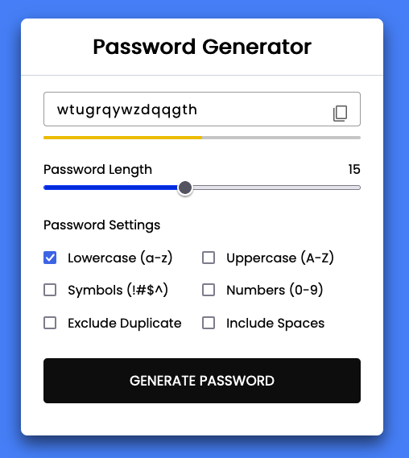
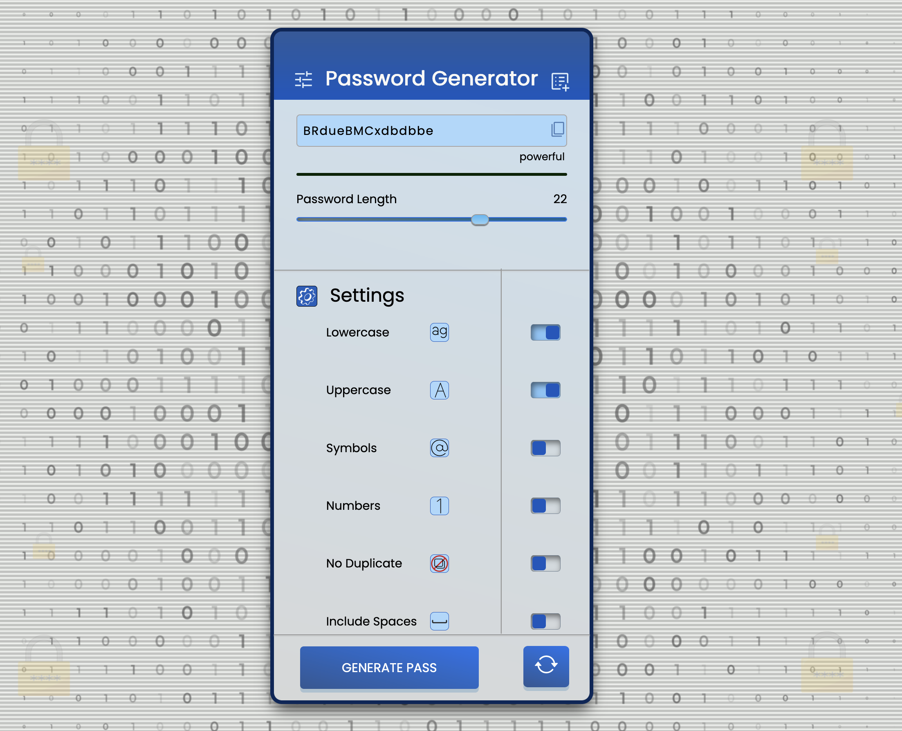
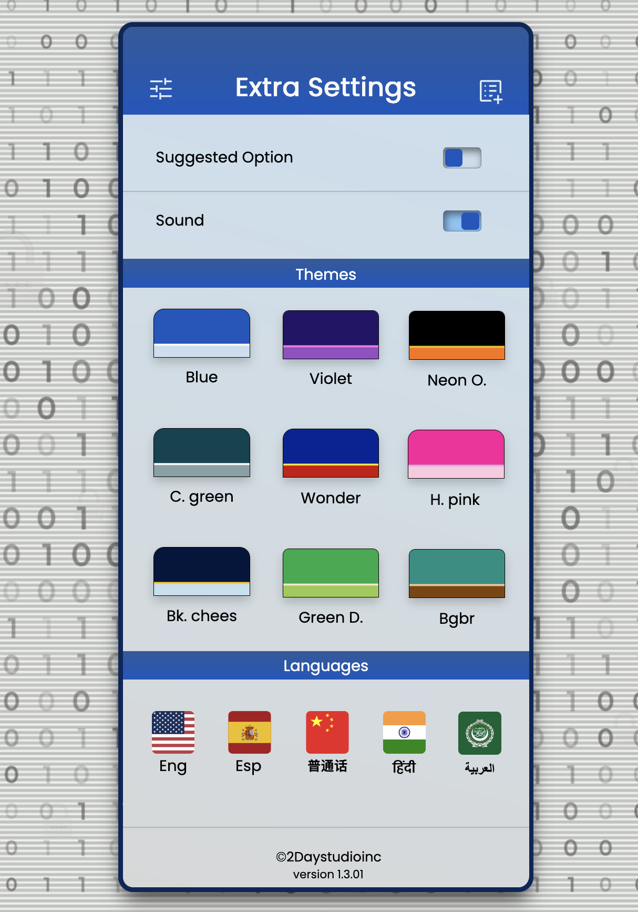
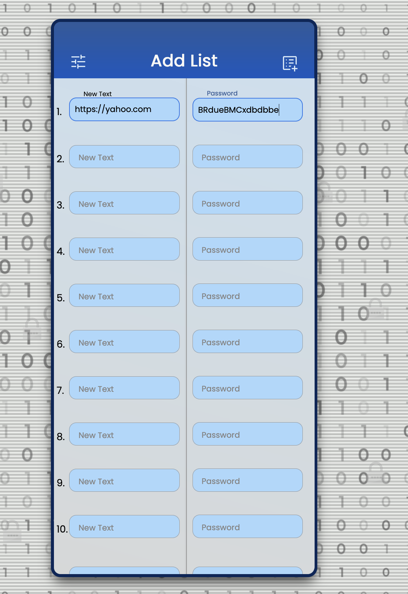

# Password-Generator

##Secure Password Generator  

This web app generates strong, random passwords up to 30 characters to enhance your online security. With future updates, it will introduce exciting features, including the ability to store up to 20 passwords securely, customize themes, and switch between multiple languages.  

---

## Features  
- Generate strong, random passwords up to 30 characters.  
- Future updates will include:  
  - Storing up to 20 passwords securely.  
  - Theme customization (light/dark mode).  
  - Multi-language support.  

---

## Screenshot  

  

version 1.00
---

## Screenshot  

 

 

 

version 1.3.01
---

## Features  
- Add an adjustment button, in which you can change the Themes and you can change the language, you can also silence the audio.  
- Add a notes button, to save passwords with your websites.It has accessible up to 20 spaces for saved.
- Additional I put the option of suggesting a random contrast, which can be activated from the adjustment menu.  

## How to Use  
1. Clone this repository:  
   ```bash  
   git clone https://github.com/yourusername/secure-password-generator.git  

